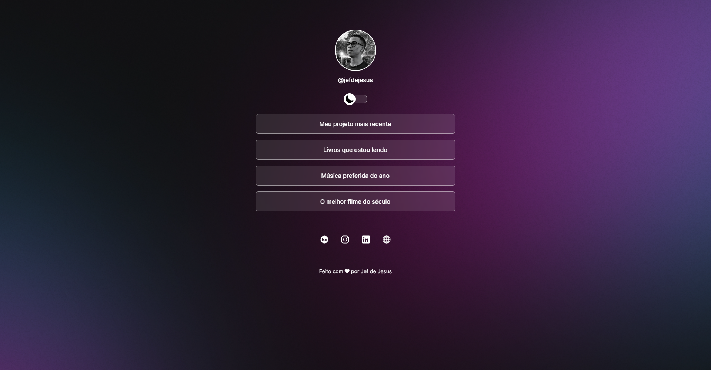
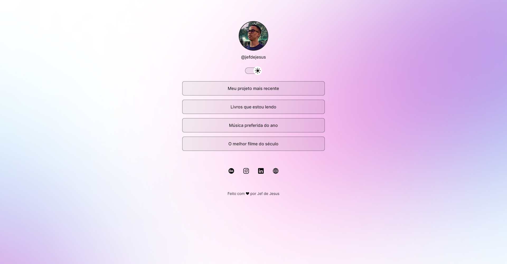

# Projeto

O projeto é um agregador de links desenvolvido durante o curso de formação básica em HTML, CSS e JavaScript da <a href="https://www.rocketseat.com.br/" target="_blank">Rocketseat</a>.

## Índice
- [Detalhes do projeto](#secao-1)
- [Previews](#secao-2)

## Detalhes do projeto

O agrupador de páginas consiste num site que possui 4 redirecionadores, sendo 1 para um link e 3 para páginas. Além disso, há ícones de redes sociais que redirecionam para o meu perfil. Também, com o auxílio do JavaScript foi possível adicionar um botão que permite a alternar entre tema claro e escuro.

## Previews

